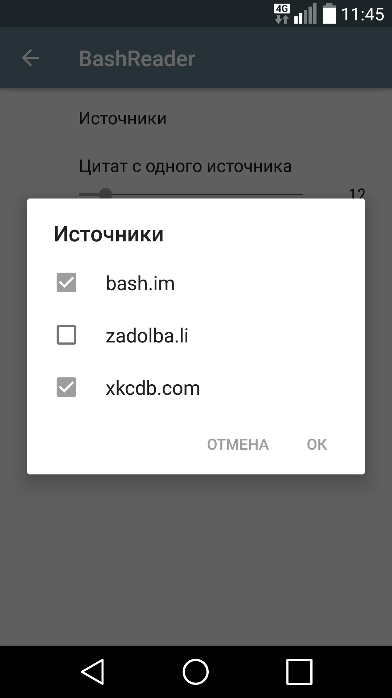

# Bash Reader

The simple reader, which uploads quotes from popular web quote databases like bash.im.

### Functionality

The app has two activities: The Main and settings screen. The main activity holds RecyclerView, which keeps quotes. Settings screen allows you to choose between different sources and quote number per source

 

## Structure 

The app implements MVVM pattern

### Used APIs

* Android Jetpack
* Retrofit 2
* OkHttp
* Room
* LiveData
* Dagger 2

## TODO

* Replace synchronous calls for different sources by asynchronous one by using Rxjava
* Add unity tests
* Main screen do not follow Material Design patterns. To be fixed
